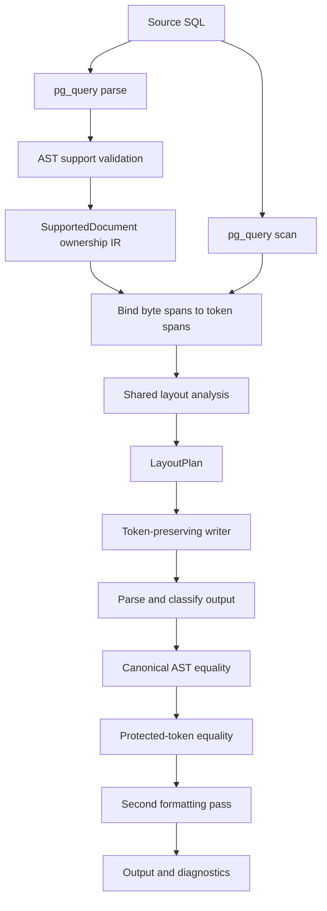

# Formatter architecture

Status: **implemented architecture and extension guide**

This document describes how the formatter currently works at code level and
how new PostgreSQL syntax should be added without duplicating a parser or
turning the layout engine into a collection of unrelated keyword scans.

The authoritative formatting behavior remains
[`semantic-block-sql-fmt-check-core-spec.md`](semantic-block-sql-fmt-check-core-spec.md).
This document describes implementation structure, not additional style rules.

## Design goals

The formatter is designed around five constraints:

1. PostgreSQL syntax ownership comes from PostgreSQL's parser, not handwritten
   SQL parsing.
2. Exact authored tokens, comments, literals, and line boundaries remain
   available to the renderer.
3. Unsupported or newly introduced PostgreSQL syntax is preserved unchanged.
4. A statement family can be added without rewriting existing planners.
5. `fmt` and `check` share one canonical formatting result and safety gates.

## Module map

```text
src/formatter/
├── mod.rs             public facade and safety pipeline
├── validation.rs      PostgreSQL AST support classification
├── ownership.rs       AST-validated source-statement ownership
├── structure.rs       syntax-neutral token depth/delimiter index
├── layout_ir.rs       token-bound statements, queries, clauses and predicates
├── tokens.rs          exact scanner tokens and authored gaps
├── semantic_block.rs  shared layout planning and token-preserving writing
└── diagnostics.rs     rule-level diagnostics and source ranges
```

Filesystem discovery, SQL directives, Go extraction, diff generation, and
atomic rewriting remain outside the formatter core.

## End-to-end flow



`format_sql` in `mod.rs` owns this sequence. It parses and validates the input,
passes the resulting ownership model into the layout engine, validates the
formatted output, and requires a byte-identical second pass.

`format_sql_result` wraps failures in a fail-safe value result: the original
source is returned unchanged with a diagnostic.

## Ownership IR

`ownership.rs` and `layout_ir.rs` form the boundary between PostgreSQL's
AST and token layout. `ownership.rs` records parser-proven source spans;
`layout_ir.rs` binds those spans to exact tokens and derives reusable clause,
query, WITH, and predicate ownership once per formatting pass.

### `StatementKind`

```rust
pub(super) enum StatementKind {
    Select,
    Insert,
    Update,
    Delete,
    Merge,
}
```

This closed Rust sum type is the central top-level dispatcher. A new statement
family is added as a new variant only when its AST validation and layout planner
are introduced together.

Unknown PostgreSQL node variants do not enter the planner. They produce
`syntax.unsupported` and preserve the original statement.

### `SourceStatement`

```rust
pub(super) struct SourceStatement {
    pub kind: StatementKind,
    pub start: usize,
    pub end: usize,
}
```

A source statement owns one UTF-8 byte span from PostgreSQL's `RawStmt`
locations. The terminal semicolon is included when present.

### `SupportedDocument`

```rust
pub(super) struct SupportedDocument {
    statements: Vec<SourceStatement>,
}
```

This is produced by `validation::parse_supported_postgresql`. It proves that
every top-level statement and every checked nested construct belongs to the
fixture-backed support boundary.

It intentionally contains only formatter-relevant ownership metadata rather
than exposing the full protobuf tree to every layout function.

### `TokenStatement`

```rust
pub(super) struct TokenStatement {
    pub kind: StatementKind,
    pub start: usize,
    pub end: usize,
    pub base_depth: usize,
}
```

`bind_token_statements` maps AST-owned byte spans to scanner-token spans.
Statement planners receive only these owned spans. They no longer discover DML
statements by scanning the complete document for words such as `INSERT`,
`UPDATE`, or `DELETE`.

If an AST-supported statement cannot be bound to the expected token shape, the
formatter returns `FormatDiagnostic::Ownership`. This is an internal safety
failure, not a silent fallback.

## AST support classification

`validation.rs` performs two related checks.

Before classifying nodes, it requires the PostgreSQL grammar version embedded
by the pinned `pg_query` backend to equal `REVIEWED_POSTGRESQL_VERSION`. A parser
dependency upgrade therefore fails closed until the new PostgreSQL AST schema,
validators, and fixtures are reviewed together; newly added fields cannot enter
the formatter merely because a crate version changed.

### Top-level statement classification

`validate_statement` matches PostgreSQL protobuf sum types and returns a
`StatementKind` for the exact supported family:

```rust
match node {
    NodeEnum::SelectStmt(select) => ...,
    NodeEnum::InsertStmt(insert) => ...,
    NodeEnum::UpdateStmt(update) => ...,
    NodeEnum::DeleteStmt(delete) => ...,
    NodeEnum::MergeStmt(merge) => ...,
    _ => Err("unimplemented PostgreSQL statement family"),
}
```

Family-specific validators check the currently owned AST shape. For example,
UPDATE currently rejects multi-column assignment targets and complex FROM
sources because no planner owns them yet.

### Nested-node validation

After top-level classification, nested PostgreSQL nodes are traversed to reject
unowned constructs such as unsupported subqueries, window forms, or lateral
sources.

This makes support explicit. Successful parsing alone never implies formatter
support.

## Token and source model

`tokens.rs` calls `pg_query::scan` and stores:

```rust
pub(super) struct SqlToken<'a> {
    pub kind: Token,
    pub keyword_kind: KeywordKind,
    pub text: &'a str,
    pub start: usize,
    pub end: usize,
    pub line_breaks_before: usize,
}
```

The AST supplies semantic ownership; scanner tokens supply exact source text.
The formatter does not deparse the protobuf AST because deparsing would discard
comments, authored groups, and original token spelling.

## Layout planning

`semantic_block.rs` builds a token-indexed `LayoutPlan`:

```rust
struct LayoutPlan {
    before: HashMap<usize, Break>,
    token_indents: Vec<Option<usize>>,
}
```

Planning functions request line breaks and indentation. The writer later emits
tokens in their original order.

Current shared analyses include:

- parenthesis pairs and syntactic depth;
- source-aware comma-separated list items;
- compact versus expanded CASE ranges;
- boolean predicate ranges;
- CTE ownership;
- terminal semicolon policy;
- soft and hard width decisions.

All statement planners now consume one `LayoutDocument` produced by
`layout_ir::LayoutDocument::bind`. Its closed `StatementLayout` sum type owns
SELECT, INSERT, UPDATE, DELETE, and MERGE spans. Shared child records include:

- `QueryBlock` and `QueryClauses` for every SELECT branch;
- `WithBlock` for CTE definitions and the owning statement body;
- `PredicateBlock` for WHERE, HAVING, JOIN ON, and ON CONFLICT predicates;
- `InsertBlock`, `UpdateBlock`, and `DeleteBlock` for family-specific clauses;
- `MergeBlock`, `MergeBranch`, and `MergeAction` for branch ownership;
- `SetOperationBlock` for UNION / INTERSECT / EXCEPT boundaries;
- `TokenSpan` for reusable owned token ranges.

The formatter no longer runs independent document-wide statement, SELECT, CTE,
or predicate discovery passes. Generic expression analyses such as CASE and
parenthesized-list complexity operate only after every statement has passed AST
classification and token ownership binding.

These structures are not PostgreSQL parsers. They locate presentation
boundaries only inside an AST-validated span whose legal shape is already known.

## Writer

The writer changes only permitted presentation details:

- whitespace;
- indentation;
- line breaks;
- required keyword/function/type casing;
- configured `<>` to `!=` normalization;
- configured terminal-semicolon policy.

It never reorders tokens or synthesizes arbitrary SQL structure.

## Safety gates

A formatting result is accepted only when all gates pass:

1. input parses as PostgreSQL;
2. input AST shape is supported;
3. every supported statement binds to its token span;
4. output parses and passes the same support classifier;
5. canonical ASTs are equal after source locations are removed;
6. literals, quoted identifiers, comments, and other protected tokens are
   byte-identical and ordered identically;
7. a second formatting pass is byte-identical;
8. every breakable line respects the hard-width policy.

No file is partially rewritten. The CLI plans every project rewrite before the
first atomic replacement.

## Adding PostgreSQL syntax

Use this sequence for each syntax extension.

### 1. Characterize the AST

Add a focused test or temporary inspection against the pinned `pg_query`
protobuf representation. Identify the owning top-level and nested node fields.
Do not infer grammar ownership from keywords alone.

### 2. Extend the closed ownership model

For a new statement family, add a `StatementKind` variant. For a new variant of
an existing family, extend its family-specific validated shape instead.

Do not create a dynamic registry merely to avoid a Rust `match`; exhaustive
matches are useful because compiler errors identify every dispatcher that must
handle a new family.

### 3. Extend validation

Update `validate_statement` and the relevant family validator. Keep adjacent
unimplemented shapes unsupported.

When PostgreSQL adds a protobuf node or field that the formatter does not know,
the default outcome must remain unchanged source plus `syntax.unsupported`.

### 4. Add or extend layout IR

Prefer reusable ownership concepts:

- statement span;
- clause span;
- delimited list;
- expression list;
- assignment list;
- predicate;
- nested statement;
- branch list.

Add a statement-specific structure only where PostgreSQL grammar has genuinely
statement-specific ownership, such as ON CONFLICT or MERGE branches.

### 5. Add fixtures before claiming support

Each supported shape requires:

- compact and expanded golden output where applicable;
- comments at ownership boundaries;
- semantic-equivalence validation;
- idempotence;
- clean `check` output after formatting;
- neighboring unsupported variants that remain byte-identical.

### 6. Run the complete gate

```text
cargo fmt --all -- --check
cargo clippy --locked --all-targets -- -D warnings
cargo test --locked --all-targets
cargo doc --locked --no-deps
git diff --check
```

## Forward compatibility policy

A PostgreSQL upgrade can produce four outcomes:

| Parser result | Ownership result | Formatter behavior |
| --- | --- | --- |
| parser rejects syntax | none | unchanged source plus parse diagnostic |
| parser accepts unknown statement family | unsupported | unchanged statement plus `syntax.unsupported` |
| known family contains unknown/unowned shape | unsupported | unchanged statement plus `syntax.unsupported` |
| known and fixture-backed shape | supported | structural formatting and full safety gates |

This policy lets the parser be upgraded independently without allowing new
syntax to fall accidentally into generic whitespace normalization.

The reviewed-parser-version gate additionally makes a `pg_query` upgrade an
explicit source change. The formatter cannot silently begin accepting a newer
PostgreSQL grammar after a dependency update.

## Current architecture boundary

The ownership migration is complete for the currently supported SQL families:

1. PostgreSQL AST validation produces `SupportedDocument`;
2. `TokenStructure` indexes delimiter depth once;
3. `LayoutDocument` binds all top-level statements, SELECT branches, WITH
   definitions, clauses, and predicates;
4. layout planners consume only these owned records and shared list/expression
   primitives;
5. the writer emits original tokens in original order.

New PostgreSQL syntax normally extends one family validator and one layout-IR
binder, then reuses existing clause, list, predicate, CASE, CTE, and writer
logic. A new statement family adds one exhaustive `StatementKind` and
`StatementLayout` variant. Existing families do not need to be rewritten.

The architecture is now exercised by SELECT, INSERT, UPDATE, DELETE, and
MERGE. The latest syntax tranche adds INSERT SELECT/OVERRIDING/DEFAULT VALUES,
shared DML WITH, grouping/sorting/pagination clauses, general set operations,
and fixture-backed MERGE branches without altering older family planners.

The next syntax extensions are:

1. windows, FILTER, and named WINDOW clauses;
2. lateral, derived, function, and multi-relation sources;
3. top-level VALUES and richer data-modifying expressions/subqueries;
4. CREATE TABLE, CREATE INDEX, and ALTER TABLE ownership;
5. routine and PL/pgSQL body ownership;
6. protected template ranges, property tests, and fuzzing.
