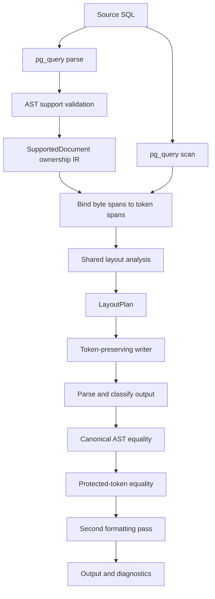

# Formatter architecture

Status: **implemented architecture and extension guide**

This document describes how the formatter currently works at code level and
how new PostgreSQL syntax should be added without duplicating a parser or
turning the layout engine into a collection of unrelated keyword scans.

The authoritative formatting behavior remains
[`semantic-block-sql-fmt-check-core-spec.md`](semantic-block-sql-fmt-check-core-spec.md).
This document describes implementation structure, not additional style rules.

## Design goals

The formatter is designed around five constraints:

1. PostgreSQL syntax ownership comes from PostgreSQL's parser, not handwritten
   SQL parsing.
2. Exact authored tokens, comments, literals, and line boundaries remain
   available to the renderer.
3. Unsupported or newly introduced PostgreSQL syntax is preserved unchanged.
4. A statement family can be added without rewriting existing planners.
5. `fmt` and `check` share one canonical formatting result and safety gates.

## Module map

```text
src/formatter/
├── mod.rs                      public facade and safety pipeline
├── validation.rs               PostgreSQL AST support classification
├── validation/
│   └── equivalence.rs          canonical AST and protected-token checks
├── ownership.rs                validated statement-shape and source/token spans
├── structure.rs                syntax-neutral depth/delimiter index
├── layout_ir.rs                layout types and document-level dispatch
├── layout_ir/
│   ├── statement.rs            statement-family token binding and shape checks
│   └── query.rs                SELECT, WITH, predicate, and set-operation binding
├── semantic_block.rs           planning orchestration and query/expression rules
├── semantic_block/
│   ├── statements.rs           INSERT/UPDATE/DELETE/MERGE planners
│   ├── ddl.rs                  VALUES and DDL planners
│   ├── expressions.rs          typed owned-expression range derivation
│   ├── lists.rs                shared list and parenthesized-argument planning
│   └── render.rs               casing, spacing, and token rendering
├── tokens.rs                   exact scanner tokens and authored gaps
└── diagnostics.rs              rule diagnostics and source ranges
```

The directories are implementation partitions, not plugin registries. Private
module boundaries keep statement-specific code small while exhaustive enums
remain the compiler-enforced dispatcher.

Filesystem discovery, SQL directives, Go extraction, diff generation, and
atomic rewriting remain outside the formatter core.

## End-to-end flow



`format_sql` in `mod.rs` owns this sequence. It parses and validates the input,
passes the resulting ownership model into the layout engine, validates the
formatted output, and requires a byte-identical second pass.

`format_sql_result` wraps failures in a fail-safe value result: the original
source is returned unchanged with a diagnostic.

## Ownership IR

`ownership.rs` and `layout_ir.rs` form the boundary between PostgreSQL's
AST and token layout. `ownership.rs` records parser-proven source spans;
`layout_ir.rs` binds those spans to exact tokens and derives reusable clause,
query, WITH, and predicate ownership once per formatting pass.

### `StatementSpec`

```rust
pub(super) enum StatementSpec {
    Select(SelectSpec),
    Insert(InsertSpec),
    Update(UpdateSpec),
    Delete(DeleteSpec),
    Merge(MergeSpec),
    Values(ValuesSpec),
    CreateTable(CreateTableSpec),
    CreateIndex(CreateIndexSpec),
    AlterTable(AlterTableSpec),
    View(ViewSpec),
    MaterializedView(MaterializedViewSpec),
}
```

This closed sum type is the top-level support contract. Each variant carries the
exact capabilities proven by the PostgreSQL AST validator. For example,
`InsertSpec` records source kind, target-column count, OVERRIDING mode,
ON CONFLICT shape, and RETURNING item count. `MergeSpec` records every branch
action and its cardinality.

The token binder must reproduce those capabilities from scanner tokens. A
mismatch is `FormatDiagnostic::Ownership`; it is never silently accepted. This
prevents validation and rendering support from drifting into two independent
lists of assumptions.

A new statement family is a new enum variant. Rust's exhaustive matches identify
every dispatcher that must be updated. A new variant of an existing statement
extends its capability record instead of introducing a registry entry or an
untyped feature flag.

### `SourceStatement`

```rust
pub(super) struct SourceStatement {
    pub spec: StatementSpec,
    pub range: SourceRange,
}
```

A source statement owns one UTF-8 byte range from PostgreSQL's `RawStmt`
locations. The range includes the terminal semicolon when one exists.

### `SupportedDocument`

```rust
pub(super) struct SupportedDocument {
    statements: Vec<SourceStatement>,
}
```

This is produced by `validation::parse_supported_postgresql`. It proves that
every top-level statement and every checked nested construct belongs to the
fixture-backed support boundary. The full protobuf tree is deliberately not
exposed to layout code.

### `StatementTokens`

```rust
pub(super) struct StatementTokens {
    pub spec: StatementSpec,
    pub range: TokenRange,
    pub semicolon: Option<usize>,
    pub base_depth: usize,
}
```

`TokenRange` is always half-open: `[start, end)`. It never includes the terminal
semicolon, which is stored separately. The previous mixed convention—where one
`end` field was sometimes inclusive and sometimes exclusive—has been removed.

Individual clause positions remain token indices because every layout record
indexes the same immutable token slice for one formatting pass. Wrapping every
position in a newtype would add conversion noise without preventing a realistic
cross-buffer error. Ranges are wrapped because boundary semantics are genuinely
error-prone; statement capability and cardinality checks protect individual
clause positions.

`bind_token_statements` maps AST-owned byte ranges to these token ranges. If a
validated statement cannot bind to its expected token or range, formatting
fails safely.

### Shape agreement

The support and binding stages form an explicit contract:

```text
PostgreSQL AST
    -> StatementSpec
    -> statement token range
    -> family binder
    -> verify presence, mode, and cardinality
    -> StatementLayout
```

Examples of verified properties include:

- WITH presence;
- SELECT/INSERT set-operation count;
- INSERT source kind and VALUES row count;
- OVERRIDING USER versus SYSTEM;
- ON CONFLICT target/action shape and assignment count;
- UPDATE/DELETE source shape, per-join type/constraint ownership, predicate,
  and RETURNING presence;
- MERGE source shape plus per-join type/constraint ownership, branch count,
  action kind, assignment/value cardinality, and conditions;
- top-level VALUES row count;
- CREATE TABLE element kind and count;
- CREATE/ALTER TABLE CHECK-constraint count and parenthesized predicate owner;
- CREATE INDEX modifiers, key/include/option counts, and secondary clauses;
- ALTER TABLE action count, syntactic action groups, and relation-option
  cardinalities;
- CREATE VIEW aliases, options, query shape, and check mode;
- CREATE MATERIALIZED VIEW aliases, storage clauses, query shape, and population mode.

A unit test deliberately constructs a contradictory `StatementSpec` and proves
that layout binding returns an ownership safety failure.

## AST support classification

`validation.rs` performs two related checks.

Before classifying nodes, it requires the PostgreSQL grammar version embedded
by the pinned `pg_query` backend to equal `REVIEWED_POSTGRESQL_VERSION`. A parser
dependency upgrade therefore fails closed until the new PostgreSQL AST schema,
validators, and fixtures are reviewed together; newly added fields cannot enter
the formatter merely because a crate version changed.

### Top-level statement classification

`validate_statement` matches PostgreSQL protobuf sum types and returns a
capability-bearing `StatementSpec` for the exact supported shape:

```rust
match node {
    NodeEnum::SelectStmt(select) => ...,
    NodeEnum::InsertStmt(insert) => ...,
    NodeEnum::UpdateStmt(update) => ...,
    NodeEnum::DeleteStmt(delete) => ...,
    NodeEnum::MergeStmt(merge) => ...,
    NodeEnum::CreateStmt(table) => ...,
    NodeEnum::IndexStmt(index) => ...,
    NodeEnum::AlterTableStmt(alter) => ...,
    NodeEnum::ViewStmt(view) => ...,
    NodeEnum::CreateTableAsStmt(matview) => ...,
    _ => Err("unimplemented PostgreSQL statement family"),
}
```

Family-specific validators check the currently owned AST shape. For example,
UPDATE still rejects multi-column assignment targets, while its FROM source
uses the shared recursive relation-source validator also consumed by DELETE and
MERGE. Each accepted source kind and join predicate is reproduced by the token
binder before planning.

### Nested-node validation

After top-level classification, nested PostgreSQL nodes are traversed to reject
unowned constructs such as unsupported subqueries, window forms, or lateral
sources.

Nested SELECT and VALUES nodes are classified from their structural protobuf
fields. The validator does not use memory addresses or parser-allocation
identity as persistent node IDs. This keeps validation deterministic and avoids
coupling support decisions to one in-memory parse instance.

This makes support explicit. Successful parsing alone never implies formatter
support.

## Token and source model

`tokens.rs` calls `pg_query::scan` and stores:

```rust
pub(super) struct SqlToken<'a> {
    pub kind: Token,
    pub keyword_kind: KeywordKind,
    pub text: &'a str,
    pub start: usize,
    pub end: usize,
    pub line_breaks_before: usize,
}
```

The AST supplies semantic ownership; scanner tokens supply exact source text.
The formatter does not deparse the protobuf AST because deparsing would discard
comments, authored groups, and original token spelling.

## Layout planning

`semantic_block.rs` orchestrates planning and builds a token-indexed
`LayoutPlan`. Statement, list, and rendering rules live in focused child
modules rather than one growing formatter file:

```rust
struct LayoutPlan {
    before: HashMap<usize, Break>,
    token_indents: Vec<Option<usize>>,
}
```

Planning functions request line breaks and indentation. The writer later emits
tokens in their original order.

Every statement, query, and keyword-list planner receives one immutable
`PlanningContext` containing the token slice, depth index, CASE analysis,
parenthesized-list analysis, and formatting options for that pass. This avoids
long parameter lists and, more importantly, prevents callers from accidentally
combining analyses produced from different token buffers.

Current shared analyses include:

- parenthesis pairs and syntactic depth;
- source-aware comma-separated list items;
- compact versus expanded CASE ranges;
- typed expression-owner ranges and context-independent Boolean ranges;
- CTE ownership;
- terminal semicolon policy;
- soft and hard width decisions.

All statement planners now consume one `LayoutDocument` produced by
`layout_ir::LayoutDocument::bind`. Its closed `StatementLayout` sum type owns
SELECT, INSERT, UPDATE, DELETE, and MERGE spans. Shared child records include:

- `QueryBlock` and `QueryClauses` for every SELECT branch;
- `WithBlock` for CTE definitions and the owning statement body;
- `PredicateBlock` for WHERE, HAVING, JOIN ON, and ON CONFLICT predicates;
- `InsertBlock`, `UpdateBlock`, and `DeleteBlock` for family-specific clauses;
- `MergeBlock`, `MergeBranch`, and `MergeAction` for branch ownership;
- `SetOperationBlock` for UNION / INTERSECT / EXCEPT boundaries;
- `TokenSpan` for reusable owned token ranges.

The formatter no longer runs independent document-wide statement, SELECT, CTE,
or predicate discovery passes. Generic expression analyses such as CASE and
parenthesized-list complexity operate only after every statement has passed AST
classification and token ownership binding. `semantic_block/expressions.rs`
derives expression ranges from those records for predicates, SELECT and
RETURNING items, assignment right-hand sides, VALUES items, CASE branches, and
function arguments. It does not scan the document for free-floating Boolean
keywords. The shared Boolean planner then applies one precedence-preserving
layout policy to every derived range.

These structures are not PostgreSQL parsers. They locate presentation
boundaries only inside an AST-validated span whose legal shape is already known.

## Writer

The writer changes only permitted presentation details:

- whitespace;
- indentation;
- line breaks;
- required keyword/function/type casing;
- configured `<>` to `!=` normalization;
- configured terminal-semicolon policy.

It never reorders tokens or synthesizes arbitrary SQL structure.

## Safety gates

A formatting result is accepted only when all gates pass:

1. input parses as PostgreSQL;
2. input AST shape is supported;
3. every supported statement binds to its token span;
4. output parses and passes the same support classifier;
5. canonical ASTs are equal after source locations are removed;
6. literals, quoted identifiers, comments, and other protected tokens are
   byte-identical and ordered identically;
7. a second formatting pass is byte-identical;
8. every breakable line respects the hard-width policy.

No file is partially rewritten. The CLI plans every project rewrite before the
first atomic replacement.

## Adding PostgreSQL syntax

Use this sequence for each syntax extension.

### 1. Characterize the AST

Add a focused test or temporary inspection against the pinned `pg_query`
protobuf representation. Identify the owning top-level and nested node fields.
Do not infer grammar ownership from keywords alone.

### 2. Extend the closed ownership model

For a new statement family, add a `StatementSpec` variant and its capability
record. For a new variant of an existing family, extend that record instead.
Every capability recorded here must later be verified by its token binder.

Do not create a dynamic registry merely to avoid a Rust `match`; exhaustive
matches are useful because compiler errors identify every dispatcher that must
handle a new family.

### 3. Extend validation

Update `validate_statement` and the relevant family validator. Keep adjacent
unimplemented shapes unsupported.

When PostgreSQL adds a protobuf node or field that the formatter does not know,
the default outcome must remain unchanged source plus `syntax.unsupported`.

### 4. Add or extend layout IR

Prefer reusable ownership concepts:

- statement span;
- clause span;
- delimited list;
- expression list;
- assignment list;
- predicate;
- nested statement;
- branch list.

Add a statement-specific structure only where PostgreSQL grammar has genuinely
statement-specific ownership, such as ON CONFLICT or MERGE branches.

### 5. Add fixtures before claiming support

Each supported shape requires:

- compact and expanded golden output where applicable;
- comments at ownership boundaries;
- semantic-equivalence validation;
- idempotence;
- clean `check` output after formatting;
- neighboring unsupported variants that remain byte-identical.

### 6. Run the complete gate

```text
cargo fmt --all -- --check
cargo clippy --locked --all-targets -- -D warnings
cargo test --locked --all-targets
cargo doc --locked --no-deps
git diff --check
```

The detailed compiler-guided procedure and review checklist are in
[`formatter-extension-guide.md`](formatter-extension-guide.md).

## Forward compatibility policy

A PostgreSQL upgrade can produce four outcomes:

| Parser result | Ownership result | Formatter behavior |
| --- | --- | --- |
| parser rejects syntax | none | unchanged source plus parse diagnostic |
| parser accepts unknown statement family | unsupported | unchanged statement plus `syntax.unsupported` |
| known family contains unknown/unowned shape | unsupported | unchanged statement plus `syntax.unsupported` |
| known and fixture-backed shape | supported | structural formatting and full safety gates |

This policy lets the parser be upgraded independently without allowing new
syntax to fall accidentally into generic whitespace normalization.

The reviewed-parser-version gate additionally makes a `pg_query` upgrade an
explicit source change. The formatter cannot silently begin accepting a newer
PostgreSQL grammar after a dependency update.

## Current architecture boundary

The ownership migration is complete for the currently supported SQL families:

1. PostgreSQL AST validation produces `SupportedDocument`;
2. `TokenStructure` indexes delimiter depth once;
3. `LayoutDocument` binds all top-level statements, SELECT branches, WITH
   definitions, clauses, and predicates;
4. layout planners consume only these owned records and shared list/expression
   primitives;
5. the writer emits original tokens in original order.

New PostgreSQL syntax normally extends one family validator and one layout-IR
binder, then reuses existing clause, list, predicate, CASE, CTE, and writer
logic. A new statement family adds one exhaustive `StatementSpec` and
`StatementLayout` variant. Existing families do not need to be rewritten.

The architecture is now exercised by SELECT, INSERT, UPDATE, DELETE, MERGE,
top-level VALUES, CREATE TABLE, CREATE INDEX, and ALTER TABLE. Query ownership
also covers filtered and ordered aggregates, window bodies, named WINDOW
clauses, and lateral derived/function sources. These additions extend exhaustive
capability records and binders without altering older family planners.

The next syntax extensions are:

1. richer joined, function, and multi-relation DML/MERGE sources;
2. richer CREATE TABLE variants and additional ALTER ownership;
3. routine and PL/pgSQL body ownership;
4. PostgreSQL arrays, JSON expressions, and additional expression families;
5. protected template ranges, property tests, and fuzzing.


## Expanded statement, relation, table, and procedural capabilities

The expanded coverage tranche preserves the existing one-way pipeline:
PostgreSQL AST validation produces closed capability records, token binding owns
source ranges, planners operate only on those records, and the writer emits the
original token stream in order.

- Common migration statements use `StatementSpec::Utility(UtilityStatementKind)`.
  This is a closed enum, not a generic "parsed utility" escape hatch. Each
  accepted `DropStmt`, `TruncateStmt`, grant, comment, type/domain/sequence,
  trigger, or policy shape is validated before rendering.
- Query capability records now carry `INTO`, row-lock, data-modifying CTE,
  `SEARCH` / `CYCLE`, and nested-subquery facts. The binder distinguishes CTE
  root statements from subqueries nested inside those statements.
- Relation items own `ROWS FROM`, sampling, aliases with column/definition
  lists, and derived `WITH` queries. Table DDL capability records own partition,
  inheritance, typed-table, storage, access-method, tablespace, and on-commit
  shapes.
- `procedural.rs` remains a separate nested-language boundary. It validates the
  `parse_plpgsql` node allowlist and uses explicit indentation frames for blocks,
  loops, CASE branches, exception handlers, and cursor/dynamic-execution forms.

No new dependency or runtime registry was introduced. Unsupported neighbors
continue to fail before token planning and preserve complete project atomicity.

## Statement outcome classifier

Top-level document processing now produces one outcome per PostgreSQL statement: formatted, unsupported/opaque, or fatal-invalid. Unsupported is not an error path by default. Reconstruction preserves source gaps outside owned statement spans, and style diagnostics are suppressed inside opaque unsupported ranges. Strict policy is applied only after all statement outcomes have been collected, preserving complete diagnostics and project-wide no-write behavior.

Operational utilities remain a closed `UtilityStatementKind` capability set. Nested-query and option-bearing utilities receive explicit layout ownership; there is no generic parser-success fallback.

## Procedural IR boundary

The procedural formatter is split into `procedural::ir` and `procedural::layout`. The IR adapter validates parser node families, binds source spans independently from line boundaries, and cross-checks key parser-node counts against lexical nodes. The layout layer consumes only typed nodes and emits indentation frames; it does not discover syntax from source lines. Outer SQL, dollar-tag preservation, normalized parser equivalence, protected literals, and idempotence remain separate gates.

## Go string-expression pipeline

Go extraction operates on tree-sitter expression nodes rather than database API names or broad declaration-only ownership. Raw literals, interpreted literals, and literal-only static concatenations are decoded into a `GoStringExpression`; runtime-dependent concatenations are retained as dynamic opaque expressions. Eligible declaration, assignment, return, call-argument, `defer`, `go`, and composite-literal contexts pass through PostgreSQL formatting.

Interpreted strings use a complete Go escape codec. Re-encoding prefers a raw literal for multiline SQL only when exact, otherwise deterministic interpreted escapes are used. The replacement is decoded again, compared with the expected runtime value, and accepted only when the complete Go file reparses. `GoFormatStats` exposes corpus-oriented counts without influencing formatting policy.

The checked-in golden project remains offline. `examples/go_corpus.rs` consumes pinned external-project metadata only when explicitly invoked, records resolved commit SHAs, formats selected tracked Go files, requires `gofmt`, a byte-idempotent second pass, and selected project tests, and emits a JSON outcome report.
